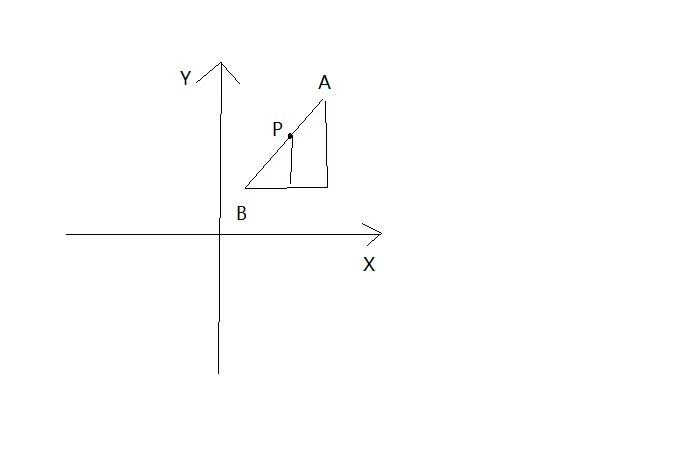

# 射线判断法

### 引入

> 如何判断一个点是否在`多边形`内?
>
> 判断点是否在多边形内,可以确定,点和多边形在坐标系内
>
> 实际的应用场景如:
>
> 首先在地图上通过画出一个区域(通过多个点之间的连线行程的区域),判断一个经纬度坐标是否在在这个区域内

### 射线判断法

> 以该点为起点,引出一条水平射线,计算射线和多边形的相交次数,奇数次表示改点在多边形内,偶数次表示改点在多边形外.


#### 水平射线和边相交的情况

1. 点和多边形的顶点重合, 如上图`A点`

2. 点在多边形的边上, `B点`

3. 点的水平射线过多边形的顶点

   过顶点的情况分为两种顶点

   - 组成顶点的两条边,在水平射线的同一侧,`E点`
   - 组成顶点的两条边,在水平射线的两侧,`C点`

4. 点的水平射线和一条边重合,这一点和`2`中有重合的部分,点可以在多边形外做射线和边重合,点也可以在那条水平边上

   - 点在和水平射线重合的水平边上,`F点`
   - 点的水平射线和一条边重合,但是点不在该条边上,`D点`

5. 以上四种为特殊情况.正常情况下,点的水平射线和边相交(相交点不在顶点)

注意:通常对于比较复杂的多边形,同一条射线和边的相交情况可能是两种情况的组合,例如,`情况5`+`情况3`,由于`情况3`又分为两种情况,所以可能出现`5+3.1`和`5+3.2`

#### 各种情况下的判断方法

1. 直接点和顶点作比较

2. 该点和边上的两个顶点,与X轴和Y轴一起构成等比关系

   

   ```
   (Ay-By)/(Ax-Bx)=(Py-By)/(Px-Bx)
   ```

   对于存在的

   - Ax=Bx 情况,上述等式已然成立
   - Ay=By 情况,该情况和情况`4.1`相同,可以提前比较三点的y轴

3. 对于该情况下的两种情况

   - 在两侧的情况:两侧的情况下纳入计数
   - 在同一侧的情况:不纳入计数

4. 判断三个点的(两个顶点和待判断的第三点)y轴坐标是否相同,同时判断P点的x坐标位置,以此区分是在图形外还是在图形内

5. 判断P点的y坐标在该边的两个顶点的y轴坐标范围之内(By<Py<Ay or Ay<Py<By  ),

   同时依据`情况2`中的关系式,可以求出相交点的x坐标,相交点(O点)的x轴坐标和P点的x坐标作比较,由于是射线,所以判断每条边和点之间的关系时,统一只取Px>Ox 或者Px<Ox 两种情况下的一种纳入计数

通过以上方法做出的计数,奇数在多边形内,偶数在多边形外

