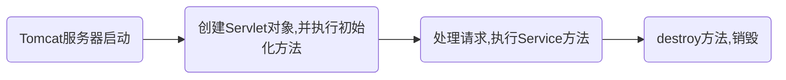

:smile:

### Servlet

#### 一、什么是Servlet？

>  处理请求和发送响应的过程是由一种叫做Servlet的程序来完成的，并且Servlet是为了解决实现动态页面而衍生的东西。理解这个的前提是了解一些http协议的东西，并且知道B/S模式(浏览器/服务器)。
>
>  


#### 二、Tomcat和Servlet的关系

> 　**Tomcat 是Web应用服务器**,`是一个Servlet/JSP容器`. Tomcat 作为Servlet容器,负责处理客户请求,把请求传送给Servlet,并将Servlet的响应传送回给客户.而Servlet是一种运行在支持Java语言的服务器上的组件. Servlet最常见的用途是扩展Java Web服务器功能,提供非常安全的,可移植的,易于使用的CGI替代品.
>
> 　从http协议中的请求和响应可以得知，浏览器发出的请求是一个**请求文本**，而浏览器接收到的也应该是一个**响应文本**。但是在上面这个图中，并不知道是如何转变的，只知道浏览器发送过来的请求也就是request，我们响应回去的就用response。忽略了其中的细节，现在就来探究一下


> 

　①：Tomcat将http请求文本接收并解析，然后封装成HttpServletRequest类型的request对象，所有的HTTP头数据读可以通过request对象调用对应的方法查询到。

　②：Tomcat同时会要响应的信息封装为HttpServletResponse类型的response对象，通过设置response属性就可以控制要输出到浏览器的内容，然后将response交给tomcat，tomcat就会将其变成响应文本的格式发送给浏览器

　*Java Servlet API 是Servlet容器(tomcat)和servlet之间的接口，它定义了serlvet的各种方法，还定义了Servlet容器传送给Servlet的对象类，其中最重要的就是ServletRequest和ServletResponse。所以说我们在编写servlet时，需要实现Servlet接口，按照其规范进行操作* 

#### 三、编写Servlet


##### 3.1手动创建Servlet

1. 创建一个class，继承`HttpServlet`  ,重写`doGet()`和`doPost()`方法，按照不同的请求方式，调用不同的处理方法。

```java
public class FirstServlet extends HttpServlet{

	@Override
	protected void doGet(HttpServletRequest req, HttpServletResponse resp) throws ServletException, IOException {
		System.out.println("this is doGet");
		String method = req.getMethod();
		System.out.println(method);
		req.getRequestDispatcher("/index.html").forward(req, resp);
	}

	@Override
	protected void doPost(HttpServletRequest req, HttpServletResponse resp) throws ServletException, IOException {
		System.out.println("this is doPost");
	}
	
}
```

2. 在web.xml中配置Servlet；

   **配置的目的**：让浏览器发出的请求知道要到哪个Servlet，即让tomcat将封装好的request请求找到对应的servlet，以便处理请求。

   ```xml
   <servlet>
      <！-- 给servlet起名字 -->
     	<servlet-name>firstServlet</servlet-name>
       < !-- servlet的全路径名 -->
     	<servlet-class>com.servlet.FirstServlet</servlet-class>
     </servlet>
       < !-- 映射路径 -->
     <servlet-mapping>
         < !-- 同上面的名字 -->
     	<servlet-name>firstServlet</servlet-name>
             < !-- 定义相关的请求路径,浏览器的请求路径到这之后，根据映射找到对应的Servlet --></!-->
             < !-- 此处一定要加‘/’></!-->
     	<url-pattern>/index/*</url-pattern>
     </servlet-mapping>
   ```

##### 3.2利用向导创建Servlet

1. 直接右键

   

2. 配置请求路径

   

3. 创建好的servlet，并没有在web.xml中配置，而是利用注解的配置

```java
//此处的注解等同于web.xml文件中的配置
//实际使用过程中，'/MyServlet'请求调用此HttpServlet
@WebServlet("/MyServlet")
public class MyServlet extends HttpServlet {
	private static final long serialVersionUID = 1L;

	/**
	 * @see HttpServlet#doGet(HttpServletRequest request, HttpServletResponse response)
	 */
	protected void doGet(HttpServletRequest request, HttpServletResponse response) throws ServletException, IOException {
		// TODO Auto-generated method stub
		response.getWriter().append("Served at: ").append(request.getContextPath());
	}

	/**
	 * @see HttpServlet#doPost(HttpServletRequest request, HttpServletResponse response)
	 */
	protected void doPost(HttpServletRequest request, HttpServletResponse response) throws ServletException, IOException {
		// TODO Auto-generated method stub
		doGet(request, response);
	}

}
```

------

#### 四、Servlet生命周期

1. Servlet生命周期是什么？
2. 为什么创建的Servlet是继承自HttpServlet ，理解类之间的继承关系

##### 4.1 生命周期是什么？


- **Servlet首先是初始化**——**创建对象并执行初始化方法**

  **初始化流程**：

  - 首先是构造方法，执行构造方法，初始化Servlet对象
  - 然后是执行init（ServletConfig config）方法，
  - 最后，执行init(),

  **初始化时，有两种情形**

  1. *当服务器启动时，初始化*。

     如果要实现这个效果，需要配置Servlet的加载顺序，

     ```xml
     <servlet>
         <servlet-name>firstServlet</servlet-name>
         <servlet-class>com.servlet.FirstServlet</servlet-class>
         <load-on-startup>0</load-on-startup>
       </servlet>
     ```

     `load-on-startup` 的值

     1. 不设置的该属性的时候，默认第一次请求初始化
     2. 当值等于0或者大于0时，服务器启动时初始化，正值越小，优先级越高
     3. 当值为负值时，第一次请求时初始化

  2. *请求的时候初始化*。

- 执行service方法，Servlet对象处理客户端请求的，在service（ServletRequest req，ServletResponse rep）

  

- 最后服务器关闭，销毁Servlet对象，执行destroy方法。

  ------

  

##### 4.2 为什么创建的Servlet是继承自HttpServlet，理解类之间的继承关系。


#### 五、重要对象讲解，ServletConfig、ServletContext，request、response 

#####  5.1 ServletConfig

***主要是用于加载servlet的初始化参数。在一个web应用可以存在多个ServletConfig对象（一个Servlet对应一个ServletConfig对象）*** 

获取：getServletConfig()

ServletConfig接口由GenericServlet实现，包含以下方法：

- getServletName();  //获取servlet的名称，也就是我们在web.xml中配置的servlet-name
- getServletContext(); //获取ServletContext对象，该对象的作用看下面讲解
- getInitParameter(String); //获取在servlet中初始化参数的值。这里注意与全局初始化参数的区分。这个获取的只是在该servlet下的初始化参

##### 5.2 ServletContext

***ServletContext对象 ,叫做Servlet的上下文对象。表示一个当前的web应用环境。一个web应用中只有一   个ServletContext对象。***

**获取**：getServletContext(); 、getServletConfig().getServletContext();　　

​	第一种，在GenericServlet中已经帮我们用getServletConfig().getServletContext();拿到了ServletContext。		我们只需要直接获取就行了

​	第二种就相当于我们自己在获取一遍，两种都是一样的。 


**功能：** Tomcat为每个web项目都创建一个ServletContext实例，tomcat在启动时创建实例，关闭时销毁。

​	        	***一个web项目只有一个ServletContext对象**

- web项目中共享数据
  - getAttribute（String name），通过指定名称获取保存在web项目中的内容；
  - setAttribute（String name，Object obj），通过设置名称（相当于<key，value>），保存数据在项目中，方便共享，所有Servlet都能访问；
  - removeAttribute(String name) 、通过指定名称移除内容   

- 整个项目初始化参数，全局初始化参数，所有Servlet都能获取该参数

  - getInitPatameter(String name)　　//通过指定名称获取初始化值
  - getInitParameterNames()　　//获得枚举类型

  ```xml
  <context-param>
  	<param-name>hello</param-name>
      <param-value>你好，世界</param-value>
  </context-param>
  ```

- 获取web项目资源

  - 获取web项目下指定资源的路径（绝对路径）

    getServletContext.getRealPath("/WEB-INF/web.xml")

  - 获取web项目下指定资源的内容，返回的时字节输入流

    InputStream getResourceAsStream(java.lang.String path) 

    ex：InputStream in = getServletContext.getResourceAsStream("/WEB-INF/web.xml")

  - 获取web项目中指定路径下的所有内容，只获取路径

    getServletContext.getResourcePath(String path)

    ex：List list = getServletContext.getResourcePath("/WEB-INF")


##### 5.3 Request

释义：

Request对象，请求文本封装而成的对象，所以通过Request可以获取请求的所有内容，请求头，请求体，请求行。

- 请求行：请求方式，资源路径，协议 ；例如：GET  /demo1/first.html  HTTP/1.1

- 请求头：referer用于防盗链，当A页面通过<a>方法到B页面，B页面有一个标记referer记录了A页面的路径。如果是直接访问B页面，没有经过A页面，referer返回null。

- 请求体：post请求的请求参数的存放位置

  **get和post方法对比：**

  get方法传递参数，在url路径后面加，第一个参数用？之后用&，url长度有限制

  将请求参数添加到请求体，请求体没有限制，post请求可以请求任意内容。

方法：

获取客户机信息：

getRequestURL方法返回客户端发出请求时的完整URL。
getRequestURI方法返回请求行中的资源名部分。
getQueryString 方法返回请求行中的参数部分。
getPathInfo方法返回请求URL中的额外路径信息。额外路径信息是请求URL中的位于Servlet的路径之后和查询参数之前的内容，它以“/”开头。
getRemoteAddr方法返回发出请求的客户机的IP地址。
getRemoteHost方法返回发出请求的客户机的完整主机名。
getRemotePort方法返回客户机所使用的网络端口号。
getLocalAddr方法返回WEB服务器的IP地址。
getLocalName方法返回WEB服务器的主机名。

获得请求头：

getHeader(string name)方法:String 

getHeaders(String name)方法:Enumeration 

getHeaderNames()方法 

获得请求参数：

- getParameter(String)方法**(常用)**
- getParameterValues(String name)方法**(常用)**
- getParameterNames()方法(**不常用**)
- getParameterMap()方法**(编写框架时常用)**

##### 5.4 Response

释义：

Response对象，服务器将处理结果返回客户端。包含响应头，响应体，响应行。

重定向：

一，手动方案

response.setStatus（302）；

response.setHeader("location","http://www.baidu.com");

二、使用封装好的

response.sendRedirect("http://www.baidu.com");

特点：服务器告诉浏览器要跳转的页面，是浏览器主动跳转的，浏览器地址会变。

**注意：**

在重定向的时候，path路径的写法：

第一种：response.sendRedirect("/test01/MyServlet01");　　

//绝对路径，使用了"/"开头，从项目根节点开始（http://localhost:8080/），所以需要写：项目名称/MyServlet01

第二种：response.sendRedirect("MyServlet");　　

//相对路径，没有使用"/"开头，相对于当前的请求路径，那么就无需写test01了。

例如：当前的请求路径是：localhost:8080/test01/index/a，这个时候如果使用相对路径，response.sendRedirect("MyServlet")，那么重定向的路径为：localhost:8080/test01/index/MyServlet


